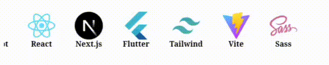
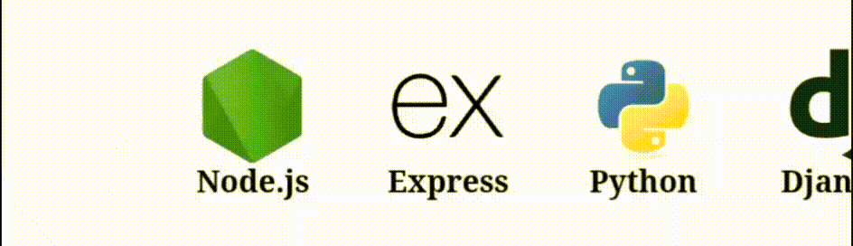

<h1 align="center"> Hey there, I'm Nishant Gupta</h1>

<em>Code. Generate. Repeat.</em>

<h3 align="center">🚀 Fullstack Web Developer | Database Engineer | B.Tech Student</h3>

  🌐 Currently pursuing my B.Tech with a passion for building responsive and interactive web apps.  
  🔭 Learning AI, ML and constantly experimenting with new technologies.

---

### 🔗 Portfolio

> 🎯 Explore my work and projects at 👉 [Portfolio Website](https://portfolio-two-amber-90.vercel.app/)  
> 📌 Don't forget to check out my GitHub activity below 👇

---

### 🛠 Tech Stack

 🌈 Frontend Development

 🏗 Backend Development

🗃 Databases

 ⚙ Tools & Platforms

---

### 📈 GitHub Stats

  
  

  

### 📫 Let's Connect

- 📧 Gmail: *gupta.nishant08042004@gmail.com*
- 🌍 Portfolio: https://portfolio-two-amber-90.vercel.app/

---

✨ Code • Generate • Repeat ✨

© 2025 Nishant Gupta
