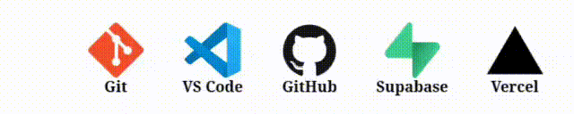

<h1 align="center"> Hey there, I'm Nishant Gupta</h1>

<em>Code. Generate. Repeat.</em>

<h3 align="center">🚀 Fullstack Web Developer | Database Engineer | B.Tech Student</h3>

  🌠Currently pursuing my B.Tech with a passion for building responsive and interactive web apps.  
  🔭 Learning AI, ML and constantly experimenting with new technologies.

---

### 🔗 Portfolio

> 🎯 Explore my work and projects at 👉 [Portfolio Website](https://portfolio-two-amber-90.vercel.app/)  
> 📌 Don't forget to check out my GitHub activity below 👇

---

### 🛠 Tech Stack

 🌈 Frontend Development

 🗠Backend Development

🗃 Databases

 ⚙ Tools & Platforms

---

### 📈 GitHub Stats

  
  

  

---

### My Github Repo

|     | Repository |🌟  Stars | ⎇ Forks |
|-----|------------|-------|-------|
| 💬 | [Real-Time-Chat-Application](https://github.com/nishant0820/Real-Time-Chat-Application) |  |  |
| 🤖 | [Quick-AI](https://github.com/nishant0820/Quick-AI) |  |  |
| 🧠 | [AI-Agent-Chatbot](https://github.com/nishant0820/AI-Agent-Chatbot) |  |  |
| 🖥 | [Server](https://github.com/nishant0820/Server) |  |  |
| 👤 | [nishant0820](https://github.com/nishant0820/nishant0820) |  |  |
| 🚗 | [Uber](https://github.com/nishant0820/Uber) |  |  |
| 🗣 | [Talk-AI](https://github.com/nishant0820/Talk-AI) |  |  |
| ✅ | [Task-AI](https://github.com/nishant0820/Task-AI) |  |  |
| 🛒 | [Ved-Stationary-Ecommerce-WebApp](https://github.com/nishant0820/Ved-Stationary-Ecommerce-WebApp) |  |  |
| 🥠| [Medical-AI-Chatbot](https://github.com/nishant0820/Medical-AI-Chatbot) |  |  |
| 📦 | [Inventory-Management-System-with-React](https://github.com/nishant0820/Inventory-Management-System-with-React) |  |  |
| 📠| [Todo-App-using-Next.js](https://github.com/nishant0820/Todo-App-using-Next.js) |  |  |
| 🛠 | [Prodigy_WD_02](https://github.com/nishant0820/Prodigy_WD_02) |  |  |
| 🛠 | [Prodigy_WD_01](https://github.com/nishant0820/Prodigy_WD_01) |  |  |
| 🛠 | [Prodigy_WD_03](https://github.com/nishant0820/Prodigy_WD_03) |  |  |
| 🛠 | [Prodigy_WD_04](https://github.com/nishant0820/Prodigy_WD_04) |  |  |
| 📱 | [Todo-App-with-Flutter](https://github.com/nishant0820/Todo-App-with-Flutter) |  |  |
| 🔠| [DeepSeek-R1](https://github.com/nishant0820/DeepSeek-R1) |  |  |
| 🯠| [Portfolio](https://github.com/nishant0820/Portfolio) |  |  |
| 🛠| [Ecommerce-with-Flutter](https://github.com/nishant0820/Ecommerce-with-Flutter) |  |  |
| 📠| [Learning-Management-Portal](https://github.com/nishant0820/Learning-Management-Portal) |  |  |
| ⚛ | [Ecommerce-with-React](https://github.com/nishant0820/Ecommerce-with-React) |  |  | 
| 💳 | [Ecommerce-using-React-Mern-and-Stripe](https://github.com/nishant0820/Ecommerce-using-React-Mern-and-Stripe) |  |  |
| 📊 | [React-Admin-Dashboard-with-Real-Time-Data-Charts-Events](https://github.com/nishant0820/React-Admin-Dashboard-with-Real-Time-Data-Charts-Events) |  |  |
| 💰 | [Crypto-Website](https://github.com/nishant0820/Crypto-Website) |  |  |
| ⏰ | [Alarm-App](https://github.com/nishant0820/Alarm-App) |  |  |
| 🌠| [3D-Globe-using-Three.js](https://github.com/nishant0820/3D-Globe-using-Three.js) |  |  |
| 🔮 | [Gemini-Clone](https://github.com/nishant0820/Gemini-Clone) |  |  |
| 🵠| [Spotify-Clone](https://github.com/nishant0820/Spotify-Clone) |  |  |
| 🪠| [Market-Website](https://github.com/nishant0820/Market-Website) |  |  |
| 🤖 | [Jarvis](https://github.com/nishant0820/Jarvis) |  |  |
| 🔒 | [E-Commerce-Login](https://github.com/nishant0820/E-Commerce-Login) |  |  |
| 🠠| [E-Commerce-Homepage](https://github.com/nishant0820/E-Commerce-Homepage) |  |  |     
| 📚 | [Student-Result-Management-System](https://github.com/nishant0820/Student-Result-Management-System) |  |  |
| 🌟 | [Portfolio-Website](https://github.com/nishant0820/Portfolio-Website) |  |  |
| 📦 | [Inventory-Management-System](https://github.com/nishant0820/Inventory-Management-System) |  |  |

### 📫 Let's Connect

- 📧 Gmail: *gupta.nishant08042004@gmail.com*
- 🌍 Portfolio: https://portfolio-two-amber-90.vercel.app/

---

✨ Code • Generate • Repeat ✨

© 2025 Nishant Gupta
